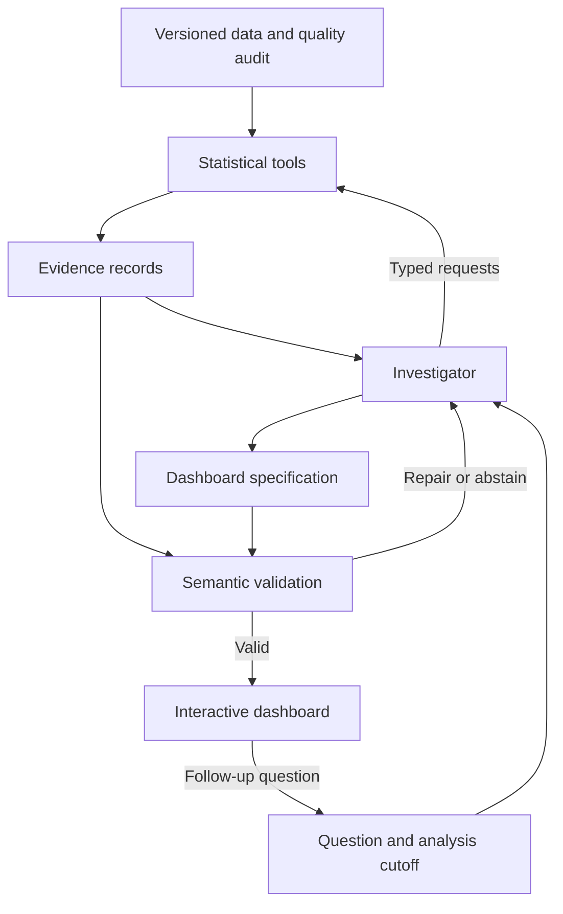

# Research plan: evidence-grounded dashboards for population and individual trajectories

Prepared for Alexander Mantzaris on September 18, 2026. Primary target: ICAART 2027, second submission stage. This is a project plan, not a manuscript or a report of completed experiments.

## 1. Recommended direction

Build a system that investigates whether an individual's apparent divergence from a population trend survives changes to reasonable comparison groups, observation windows, and exposure definitions. Have an agent turn that investigation into a customized, executable dashboard that preserves the evidence needed to interpret the result.

**Proposed working title:** *Reference-Sensitive Agentic Dashboards for Longitudinal Cohort Analysis*.

**Primary domain:** education and skill development, using the Open University Learning Analytics Dataset (OULAD).

**Primary contribution:** a constrained investigation policy and evidence contract that make reference-group sensitivity visible in both the conclusion and the generated dashboard. The statistical methods provide a dependable foundation; they are not presented as new estimators.

**Primary research question:** Under matched analytical access and bounded budgets, does an agent that explicitly audits comparison-group sensitivity produce more correct and sufficiently complete dashboards than a strong deterministic generator and a generic tool-using agent?

**Testable hypothesis:** On held-out analytical tasks, the proposed policy improves the proportion of dashboards that contain the required evidence, answer the question correctly, and avoid unsupported conclusions. Any claim of improved efficiency must also survive comparison with deterministic enumeration of all permitted references.

An impressive interface is necessary for the project, but insufficient for the research claim. The claim concerns the relationship between an analytical decision, the evidence supporting it, and the dashboard that communicates it.

Assumptions: one experienced developer-researcher; about 100-145 focused hours before submission; a normal workstation; no model training; one pinned tool-capable language model; optional expert review if reviewers are available. A single agent is the default. Multiple agents are an experimental extension, not a premise.

There are **34 calendar days** from September 18 to October 22. Aim to submit on October 20, leaving two days for corrections.

## 2. Candidate contributions and novelty assessment

The following are research formulations, not established findings. They should not all become features in one submission.

| Candidate | Research question and testable claim | Contribution beyond an anomaly detector plus an LLM interface | Purpose of an agent |
| --- | --- | --- | --- |
| A. Evidence-preserving dashboard compilation | Can binding every quantitative claim and chart to an executable evidence record reduce incorrect or untraceable dashboards? Claim: fewer material errors at comparable question coverage. | A claim-to-computation contract, semantic validation, and a benchmark for omissions as well as hallucinations. | Translate changing user questions into evidence and chart selections while remaining inside an audited grammar. |
| B. Reference-sensitive individual investigation, recommended | Does auditing defensible reference groups prevent misleading conclusions about individual divergence? Claim: higher sensitivity to comparison-dependent conclusions without excessive false alarms or abstention. | Explicitly represent an individual conclusion as conditional on a reference definition; require the dashboard to expose consequential disagreement. | Choose the next comparison or diagnostic based on what remains ambiguous, and explain why a reference is relevant to the requested estimand. |
| C. Budgeted investigation of competing explanations | Can a sequential policy distinguish baseline differences, exposure differences, data gaps, and residual changes with fewer analyses? Claim: better verified question coverage per analysis call or lower cost at matched accuracy. | An action-selection and stopping problem with observable evidence states and explicit unresolved alternatives. | Adapt the next tool call to previous results rather than always running the same sequence. |
| D. Disagreement resolution between analytical specialists | Can a separate critic improve conclusions when trend, quality, and residual analyses disagree? Claim: fewer unresolved contradictions than a compute-matched single agent. | A structured conflict representation and resolution protocol, if the protocol itself is tested. | A challenger looks for omitted comparisons and disconfirming evidence using a separate context. |
| E. Role-dependent evidence selection with invariant facts | Can dashboards change analytical content for a learner, instructor, and researcher while preserving material facts? Claim: better role-specific task coverage with no loss of mandatory evidence. | A formal distinction between optional role-specific views and evidence that no personalization may omit. | Map a user's objective to relevant comparisons, windows, and follow-up actions. |

| Candidate | Minimum convincing experiment | Strongest reviewer objection | Regular-paper route | Position-paper fallback |
| --- | --- | --- | --- | --- |
| A | Same inputs, questions, and model; compare free code generation, unrestricted specifications, and validated evidence contracts on numerical, provenance, and omission errors. | This is ordinary typed programming or visualization validation. | A reproducible error taxonomy, held-out tasks, meaningful semantic checks, and measured reliability gains. | Argue that generated dashboards should be treated as executable scientific arguments, with enforceable evidence obligations. |
| B | Real longitudinal cases plus controlled reference and exposure perturbations; compare strong rules, generic agent, and proposed policy using identical statistical tools. | The benchmark rewards a hand-written reference hierarchy, or a rule engine already solves the problem. | Independently authored tasks, multiple admissible references, strong enumeration baseline, and improvement or a useful accuracy-cost tradeoff. | Defend the thesis that comparative claims about people must expose reference dependence and uncertainty. |
| C | Known competing explanations in simulations and semi-synthetic cases; evaluate resolution, unnecessary calls, and stopping errors. | A fixed diagnostic decision tree is simpler and equally good. | Show generalization to held-out combinations of failure modes under matched budgets. | Develop a bounded evidence-acquisition framework and testable stopping principles. |
| D | Single agent versus investigator-plus-critic with equal total tokens, tools, and revision opportunities. | More calls, rather than agent separation, explain the effect. | Demonstrate a reproducible benefit that survives compute matching and role ablation. | Analyze when independently scoped criticism should help, and when correlated model errors undermine it. |
| E | Matched role-specific questions with independently defined evidence requirements; objective checks plus a modest human study if feasible. | This is template selection, and usefulness lacks human evidence. | Show analytical content changes and measured task performance, not merely preference ratings. | Propose invariant evidence requirements for personalized analytical interfaces. |

Select **B**, supported by a minimal implementation of **A**. Treat **C** as a bounded investigation mechanism. Defer **D** unless the single-agent system is already stable. Implement **E** through three roles and question types, without making broad usability claims.

### Closest verified primary literature

| Work | What is already established in that work | Implication for this project |
| --- | --- | --- |
| [LIDA, Dibia, ACL demonstrations 2023](https://aclanthology.org/2023.acl-demo.11/) | A staged system summarizes data, proposes visualization goals, and generates/refines visualization code. | Do not claim that LLM-based chart generation or a staged visualization pipeline is novel. |
| [InsightPilot, Ma et al., 2023](https://arxiv.org/abs/2304.00477) | An LLM iterates with an analytical engine through structured analytical queries. | Tool-based iterative investigation alone is insufficient novelty. |
| [Data-Copilot, Zhang et al., 2023](https://arxiv.org/abs/2306.07209) | An agent uses prepared analytical interfaces to process data and produce user-directed visual outputs. | Predefined tools and reduced reliance on generated code are already established approaches. |
| [Data Formulator 2, Wang et al., 2024/2025](https://arxiv.org/abs/2408.16119) | Iterative visualization authoring combines interface controls, natural language, data transformations, and reusable history. | Interactive follow-up and maintaining analysis history are not sufficient novelty. |
| [InsightBench, Sahu et al., 2024](https://arxiv.org/abs/2407.06423) | Evaluates multistep insight generation on datasets with planted insights. | An investigation benchmark is plausible, but must distinguish real observational evidence from planted truth. |
| [DABstep, Egg et al., 2025](https://arxiv.org/abs/2506.23719) | Tests realistic multistep data analysis with automatically checkable answers. | Adopt executable answer checks; avoid making an LLM judge the sole authority. |
| [TiInsight, Zhu et al., 2026](https://arxiv.org/abs/2601.09404) | Combines hierarchical data context, question decomposition, SQL generation, and visualization. | Generic cross-domain analysis and visualization orchestration are occupied territory. |
| [CoCo: Cohort Comparison of Event Sequences, 2015](https://dl.acm.org/doi/10.1145/2678025.2701407) | Integrates statistical comparison and visual exploration of temporal-event cohorts. | Cohort comparison and coordinated visual evidence predate LLM agents. The publisher's indexed abstract was available; full-text retrieval was blocked. |
| [Multiverse analysis, Steegen et al., 2016](https://journals.sagepub.com/doi/10.1177/1745691616658637) | Examines how conclusions change across defensible data-processing choices. | Sensitivity to reasonable analytical choices is an established principle. The proposed contribution must be its bounded agent policy and dashboard/task evaluation, not the principle itself. |

**Research judgment:** the defensible opening is the explicit treatment and evaluation of reference-dependent individual conclusions, combined with dashboard evidence obligations. This search establishes close prior art; it does not establish priority or prove that no prior system covers the proposed mechanism. Before implementation grows, inspect the methods and related-work sections of these papers and search their citations for cohort comparison, statistical multiverse analysis, adaptive exploration, and longitudinal visual analytics. If a close match already exists, shift the contribution toward an independent benchmark and measured failure modes instead of claiming a new architecture.

## 3. Dataset decision and verification

Verification levels matter. I downloaded and inspected the public OULAD and Parkinson's archives on September 18. GLOBEM and MIMIC access conditions were checked in their authoritative documentation, but their restricted files were not accessed. PMData and StudentLife are provisional candidates because their original download pages could not be retrieved during this check.

### Shortlist

| Dataset and source | People, repetitions, and duration | Features and useful context | Access, license, and schedule decision |
| --- | --- | --- | --- |
| **OULAD, primary.** [Original project](https://analyse.kmi.open.ac.uk/open_dataset); [creator-deposited UCI copy](https://archive.ics.uci.edu/dataset/349/open%2Buniversity%2Blearning%2Banalytics%2Bdataset) | Direct archive inspection: 28,785 distinct student identifiers; 32,593 student-course records; 22 module-presentations; 173,912 assessment records. Course lengths are 234-269 days across 2013/2014 presentations. These are not 32,593 independent people. | Daily learning-platform interaction records, assessment scores and submission dates, course/assessment definitions, registration/withdrawal, prior education, study load, previous attempts, and demographic bands. Seven modules and eight archive files. | Public, CC BY 4.0. UCI download succeeded; the original project site was inaccessible from this session. No repository approval required. Best immediate choice. |
| **Parkinson's Telemonitoring, compact fallback.** [UCI source](https://archive.ics.uci.edu/dataset/189/parkinsons%2Btelemonitoring) | 42 people, 5,875 recordings over a six-month study; archive counts confirmed. Subject ID and elapsed test time are available. | 16 voice measures, age, sex, motor and total UPDRS fields. Clinical scores are linearly interpolated; they are not 5,875 independent clinical examinations. | Public, CC BY 4.0; direct download succeeded. Small enough for a same-day prototype. No repository approval required. |
| **GLOBEM, stronger later wearable extension.** [PhysioNet v1.1](https://physionet.org/content/globem/1.1/) | 497 distinct participants across 705 participant-year records; four approximately ten-week campaigns, 2018-2021. This is not continuous four-year monitoring of every person. | Daily behavioral features and weekly questionnaires, with participant/date keys. Smartphone platform is available; demographic data require a separate request. Some first-year labels were inferred from other questionnaire items. | Credentialing, CITI training, and a signed DUA; PhysioNet Credentialed Health Data License 1.5.0. Do not put access approval on the critical path. |
| **MIMIC-IV, later clinical extension.** [PhysioNet v3.1](https://physionet.org/content/mimiciv/3.1/) | Documentation describes more than 65,000 ICU patients and more than 200,000 ED patients. Numerous measurements within admissions and potentially across admissions; individual follow-up varies. Source period 2008-2022. | Patient, admission, and stay identifiers; measurements, treatments, demographics, diagnoses, and outcomes. Variable dictionaries span many event types rather than one fixed feature matrix. Dates preserve within-person intervals but are shifted between people. | Credentialing, CITI training, and DUA; PhysioNet Credentialed Health Data License 1.5.0. High extraction and interpretation burden. Exclude from this deadline unless access and a validated cohort extraction already exist. |
| **PMData, provisional athletics option.** [Simula source](https://datasets.simula.no/pmdata/); [author's dataset listing](https://www.kaggle.com/datasets/vlbthambawita/pmdata-a-sports-logging-dataset) | Simula's indexed description reports 16 participants over five months. This small number limits subgroup inference regardless of the number of sensor samples. | Advertised sources include Fitbit, PMSys, and Google Forms. Potential fit for activity and self-report trajectories, subject to checking actual fields and completeness. | Original host could not be retrieved. Exact current license, downloadable files, and identifier schema were not verified. Reconsider only after a successful access and license audit; do not schedule it as the primary or guaranteed fallback. |
| **StudentLife, provisional behavioral alternative.** [Original Dartmouth source](https://studentlife.cs.dartmouth.edu/); [dataset page](https://studentlife.cs.dartmouth.edu/dataset.html) | The original project description reports 48 students over ten weeks, with repeated sensing and self-report observations. | A plausible source for student behavior and well-being; exact retained streams, identifier coverage, and current redistribution terms need inspection. | Original pages were inaccessible during the check. Current license and download status remain unverified. OULAD offers the safer immediate route. |

The last two rows are useful leads, not fully cleared datasets. Their unresolved fields are deliberately left unresolved rather than inferred from third-party mirrors.

### What each dataset can and cannot establish

| Dataset | Analyses it can support | Evaluation beyond a dashboard illustration | Important limits |
| --- | --- | --- | --- |
| OULAD | Within-course population and subgroup trajectories; individual changes in recorded engagement; comparisons conditional on study stage and prior observed history. | Deterministic queries with independently computed answers; held-out future assessment outcomes; outcome-linked case audits; realistic missingness and comparison stress tests. | Clicks do not measure ability, effort, or time spent studying. Scores on different assessments are not automatically comparable. Withdrawal is not a label for an unexplained anomaly. |
| Parkinson's | Within-person voice trajectories, baseline-adjusted deviations, and small-cohort comparisons. | Subject-held-out prediction and controlled perturbations; reproducible real-data evidence selection. | Interpolated outcomes cannot validate acute clinical change. Limited treatment/exposure context; no diagnostic or causal conclusions from this exercise. |
| GLOBEM | Behavioral trajectories, observation coverage, questionnaire associations, and cross-campaign transfer. | Held-out participant/campaign outcomes and generalization checks, if authorized access exists. | Screening responses are not clinical diagnoses; inferred labels must be separated from directly reported labels. Individual date shifts complicate calendar-level cohort comparisons. |
| MIMIC-IV | Relative-to-admission physiological trajectories and conditional patient comparisons in a defined cohort. | Existing recorded outcomes and carefully specified prediction tasks. | Treatment confounding, informative measurement, censoring, and clinical expertise requirements are substantial. Outlier detection is not a validated deterioration detector. |
| PMData | Potential activity and recovery-pattern comparisons after an audit. | Real cases plus clearly labeled semi-synthetic perturbations. | Do not assume injury, overtraining, or improvement labels exist. Sixteen people cannot sustain elaborate subgroup claims. |
| StudentLife | Potential individual and cohort behavioral comparisons after an audit. | Real-case queries and temporal prediction if adequate outcomes and observation coverage are present. | Small cohort, self-report uncertainty, and current access/terms unresolved. |

### Primary dataset scope

Use two modules with compatible repeated presentations for initial development. Select them using structural criteria: enough observations, repeated assessments, usable dates, and sufficient enrollment. Do not choose modules because their anomalies look especially persuasive. Reserve at least one additional module for a transfer check only after the main pipeline works.

Use 6-8 interpretable weekly features: recorded interaction count, number of days with recorded activity, resource-type counts or shares, assessment score when observed, submission delay when defined, and submission/non-submission status. Keep contextual variables separate: enrollment stage, studied credits, prior attempts, previous education, and available prior assessment history.

Do not call the fraction of days with clicks a sensor-coverage estimate. An absent click record may reflect no recorded platform activity, offline study, lack of opportunity, or unavailable logging information. Observation status, administrative eligibility, and behavioral inactivity require distinct fields.

Restrict the main interpretation to **recorded engagement and assessment trajectories**. The system may identify evidence consistent with a change, but should not label a learner as lazy, deficient, or in need of intervention based on these data.

The fallback changes the empirical story to voice-measure trajectories. It cannot substitute for an education experiment while retaining educational claims. An optional second-domain demonstration is allowed only if its adapter takes at most one development day and does not delay the main evaluation.

## 4. Statistical formulation

Let individual i have observations at possibly irregular times t_ij, feature k, prespecified subgroup g(i), time-varying context x_ij, static context z_i, and observation indicator R_ijk. Let c be the analysis cutoff.

A useful general model is:

\[
g_k\{\mathbb{E}(Y_{ijk}\mid b_{ik},x_{ij},z_i)\}
=\alpha_k+f_k(t_{ij})+\delta_{g(i),k}+h_{g(i),k}(t_{ij})
+b_{0ik}+b_{1ik}t_{ij}
+\beta_{Wk}^{\top}(x_{ij}-\bar{x}_{i,\le c})
+\beta_{Bk}^{\top}\bar{x}_{i,\le c}
+\gamma_k^{\top}z_i.
\]

Here f_k is the population trajectory, delta and h represent subgroup offsets and subgroup trajectories, b_0 is the individual baseline, and b_1 is an individual slope difference. The within-person and between-person covariate terms distinguish a change in a person's exposure from a stable difference between people. They remain associational. For prospective tasks, covariate summaries at every forecast origin must use only information available then.

Specify the reference coding and centering constraints so population, subgroup, and individual terms are identifiable. For OULAD, a module-specific population is the default: pooling unrelated modules into one apparent learning trajectory is usually inappropriate.

### Minimum adequate model

Start with a linear mixed model for a small set of transformed weekly behavioral features, using a low-complexity time basis and random intercepts. Add random slopes only when the training data support stable fits. Analyze assessment outcomes separately with assessment-specific effects or training-fitted standardization; do not interpret raw scores across different tests as one common scale.

Use held-out residual calibration and person-level or appropriate temporal block resampling. Ordinary mixed-model standard errors alone do not solve serial correlation, model misspecification, or informative dropout. A failed or singular fit triggers a logged simpler model and an uncertainty warning.

For the Gaussian working model, make the observation layer explicit: transformed measurements equal the modeled mean plus a residual error, individual random effects have a fitted covariance, and within-person errors may be serially correlated. Observed measurements enter only when their observation indicator is valid. With irregular times, an exponential covariance in elapsed-time separation is one possible sensitivity model; a block-resampling approach is a simpler alternative. Without replicate measurements or quality annotations, residual variation cannot be uniquely separated into instrument error and genuine short-term behavior. The agent must preserve that uncertainty rather than classify every unusual residual as measurement failure.

[Statsmodels' mixed-model documentation](https://www.statsmodels.org/stable/mixed_linear.html) provides an implementation foundation. Freeze the actual tested package versions in the project lockfile.

| Method | Advantages | Limitation here | Decision |
| --- | --- | --- | --- |
| Mixed-effects models | Interpretability, partial pooling, unequal record counts, population and person effects. | Distributional assumptions; nonlinear trajectories and informative observation require care. | Primary foundation. |
| Hierarchical Bayesian models | Direct uncertainty propagation, regularization, flexible observation models. | More diagnostics, modeling decisions, and compute. | Escalate only for a demonstrated calibration problem; optional later extension. |
| Latent factors / PCA | Compact multivariate structure and correlated-feature handling. | Factors can be unstable or difficult to interpret; global PCA may erase within-person changes. | Optional low-dimensional residual representation. |
| Change-point detection | Localizes abrupt persistent changes. | Seasonality, deadlines, sparse observations, and tuning can create false changes. | One simple residual-based method, only if tasks require onset localization. |
| Trajectory clustering | Useful for exploratory heterogeneity. | Cluster discovery and confirmation on the same data create optimistic stories. | Optional; train-only discovery and stability reporting. |
| Isolation Forest or similar anomaly detection | Flexible nonlinear baseline. | A high score provides neither a causal explanation nor a defensible reference. | Statistical baseline with training-fitted preprocessing. |

### Separate three meanings of deviation

1. **Population difference:** the individual differs from a defined population distribution. This may be a stable, ordinary baseline difference.
2. **Reference-adjusted difference:** the person differs from a prespecified comparable group at a comparable stage. This depends on which comparison answers the user's question.
3. **Change from personal history:** recent observations depart from a model fitted or calibrated using earlier personal history. This is the relevant quantity for a new individual change.

Use separate outputs for these estimands. Otherwise a random effect can absorb a persistent person difference and hide it, or a population score can mislabel a stable personal characteristic as a new event.

For a chosen reference r, compute a vector of calibrated residual summaries u_iw^(r) in window w. A simple multivariate score is:

\[
A_{iw}^{(r)}=(u_{iw}^{(r)})^{\top}(\widehat\Sigma_r+\lambda I)^{-1}u_{iw}^{(r)}.
\]

Use covariance shrinkage and a fixed feature set. Estimate thresholds on independent calibration windows; do not assume a chi-squared null distribution when residuals are correlated, estimated, or selected. Do not invert a different uncalibrated covariance matrix for every missingness pattern. For the minimum system, use a common sufficiently observed subset and abstain on unsupported patterns.

### Reference sensitivity

Define a small registry of admissible reference families before evaluating agents: same module and presentation; comparable study stage; baseline-history strata; and an explicitly exposure-adjusted comparison when that answers a distinct question. Exclude the focal individual from their peer summary. Ban future outcomes and variables observed after the query cutoff from reference selection.

Let d_iw^(r) be a standardized contrast for reference r. Report:

\[
S_{iw}=\max_{r\in\mathcal R_{\mathrm{valid}}}d_{iw}^{(r)}
-\min_{r\in\mathcal R_{\mathrm{valid}}}d_{iw}^{(r)}.
\]

Also record sign changes, changes across a prespecified practical-effect threshold, and changes in evidential support. A range alone does not establish that any particular reference is correct. If two defensible references answer different questions, show both questions and their conclusions rather than choosing the more dramatic one.

For peer weights w_j, report effective sample size as (sum_j w_j)^2 / sum_j w_j^2, distinct people, time coverage, and overlap in baseline/exposure distributions. Start with simple unweighted strata rather than complex matching.

### Conditions for interpreting or withholding a flag

Require a practically relevant magnitude, sufficient observations, and adequate comparator support. Persistence across consecutive windows is a development-tuned option, not a universal requirement. Express direction neutrally: a deviation can be beneficial, expected, uncertain, or unfavorable only with appropriate external context.

For formal tests, define the family of features, people, windows, and comparisons before analysis. Apply an appropriate multiplicity procedure to that family; Benjamini-Hochberg requires suitable dependence conditions. Use a more conservative procedure or resampling if those conditions are doubtful. Agent-discovered analyses remain exploratory until tested on untouched data. Never let repeated tool calls silently become repeated uncorrected significance tests.

Irregular sampling is represented with elapsed time, eligibility, and interval lengths. Calendar time and cumulative exposure are different estimands. Registered days are not actual study hours. Conditioning on contemporaneous activity may remove part of the phenomenon of interest, so report the adjusted and unadjusted question explicitly rather than claiming that adjustment reveals the true cause.

Missing data are modeled and displayed as an observation process, not repaired invisibly. Keep observed values, administrative absence, non-submission, and unknown availability separate. Use complete-case or carefully specified imputation sensitivity checks where appropriate, fitted only on development data. If dropout could be informative, show a sensitivity analysis and avoid claiming that missing-at-random modeling resolves it.

Return **insufficient evidence** for too little history, very small or poorly overlapping reference groups, unsupported measurement comparability, unknown units, failed fits, uncalibrated missingness patterns, or evidence that cannot distinguish competing interpretations. No universal sample-size cutoff is a theorem; freeze practical thresholds using development diagnostics and disclose them.

## 5. Agent, evidence, and dashboard architecture

### Division of responsibility

| Operation | Owner | Reason |
| --- | --- | --- |
| Parse source files, verify keys, attach units and time semantics | Deterministic ingestion with reviewed dataset adapter | Ambiguous schemas should be resolved explicitly, not guessed at every request. |
| Calculate trends, residuals, intervals, cohort support, and sensitivity | Versioned analytical tools | Numerical correctness and replay require executable calculations. |
| Interpret a question, propose admissible analyses, request another comparison, select evidence | Constrained investigator agent | These choices vary with the user's objective and previously observed results. |
| Decide whether evidence is sufficient to support an allowed claim | Deterministic rules plus agent proposal | The agent can propose a claim, but must satisfy its evidence requirements. |
| Select panels and follow-up analyses | Investigator through a structured specification | Personalization changes the evidence shown while preserving mandatory context. |
| Check identifiers, values, units, denominators, allowed claims, and chart semantics | Deterministic validator | These checks should not depend on a second model's opinion. |
| Challenge an omitted alternative | Optional second agent | Only useful if its additional cost produces measurable improvement. |
| Render and export | Controlled renderer | Same specification should produce a reproducible dashboard. |

The flow is ingestion and quality audit; a frozen feature table; statistical evidence; question interpretation; bounded investigation; evidence selection; specification; validation; rendering; and follow-up. Each follow-up produces a new version linked to its parent, with changed filters, reference groups, and claims recorded.



### Compare three orchestration choices

**Deterministic workflow:** map a structured question to a reference hierarchy, run a diagnostic decision tree, and render template panels. This is inexpensive, reproducible, and likely strong. It is the essential baseline and the production fallback when an agent fails.

**Single tool-using agent, recommended:** use one investigator with access to the same tool registry, admissible references, and renderer. Limit the number of analyses and revisions. State includes the question contract, available evidence, alternatives checked, unresolved alternatives, remaining budget, and stopping reason.

**Two-agent extension:** an investigator drafts the evidence selection; a challenger identifies a missing required comparison or unsupported interpretation. The investigator gets one revision. Share evidence records, not free-form hidden conversations. The challenger cannot certify a result merely by agreeing. Use the same total model and tool budget as the single-agent condition; use additional single-agent self-review as a comparator.

Do not create separate agents for ingestion, arithmetic, plotting, or writing boilerplate. They add coordination and failure opportunities without a clear research purpose.

### Bounded investigation policy

1. Build a question contract: subject or cohort, cutoff, target quantity, role, eligible reference families, and permitted exposure definitions.
2. Obtain the focal trajectory, a default cohort comparison, and observation/eligibility diagnostics.
3. If the apparent difference could reflect initial ability or study stage, inspect the corresponding admissible reference.
4. If adjustment changes the target question, show that change explicitly. Preserve the original comparison.
5. Request at most a small number of further diagnostics selected from a fixed tool registry. Record what each analysis can and cannot distinguish.
6. Stop when the required evidence is present, the available tools cannot resolve the remaining ambiguity, or the budget is exhausted.
7. Produce an allowed conclusion state and a dashboard containing mandatory evidence plus a bounded number of optional panels.

Initial engineering budget: at most six analytical calls and six panels per task, plus one specification-repair attempt. Tune these limits only on development tasks. Include a deterministic exhaustive-reference baseline when the reference registry is small; otherwise an efficiency claim against a weak decision tree would be unconvincing.

This is a policy over observable evidence states. It is not a claim to implement optimal Bayesian experimental design. A future extension could formalize expected information gain, but estimating it is unnecessary for the minimum study.

### Core data contracts

| Contract | Essential fields |
| --- | --- |
| `DatasetManifest` | Dataset name and version, source URL, access/license record, file hashes, table schemas, identifier semantics, units, time origin, observation-status definitions. |
| `ObservationTable` | `person_identifier`, `episode_identifier`, `observation_time`, `feature_name`, `observed_value`, `unit`, `observation_status`, `eligibility_status`, `source_row_identifier`. |
| `QuestionContract` | `question_identifier`, `role`, `analysis_cutoff`, `target_estimand`, `focal_person_or_cohort`, admissible references, required outputs, budget. |
| `AnalysisRequest` | Named method, feature set, exact filter, cutoff, reference definition, window, model/configuration version, random seed. |
| `EvidenceRecord` | Request hash, data hash, source-row set/hash, computed result table, units, distinct people and observations, interval method, comparison support, diagnostics, limitations, execution status. |
| `ClaimRecord` | Claim type, referenced evidence IDs, comparator and time window, magnitude/direction fields supplied by tools, uncertainty, support status, unresolved alternatives. |
| `DashboardSpecification` | Question ID, evidence IDs, panel types, data bindings, allowed encodings, displayed reference, mandatory annotations, follow-up actions, parent specification ID. |
| `RunManifest` | Code commit, environment lock hash, model identifier, sampling settings, prompts, tool calls/results, token usage, timestamps, costs, validation attempts, final status. |

Use an evidence graph: source rows support transformations, transformations support analytical results, results support claims, and claims require dashboard panels. Record both source traceability and analytical justification. A valid file hash alone does not establish that a claim follows from the data.

An illustrative specification shape, with no fabricated measurements:

```json
{
  "question_identifier": "heldout_question_014",
  "analysis_cutoff": {"relative_course_day": 84},
  "role": "instructor",
  "conclusion_type": "reference_sensitive",
  "claims": [
    {
      "template_identifier": "contrast_changes_across_references",
      "evidence_identifiers": ["comparison_default", "comparison_stage"]
    }
  ],
  "panels": [
    {
      "panel_type": "individual_and_reference_trajectory",
      "data_reference": "comparison_default.trajectory_table",
      "show_observed_points": true,
      "uncertainty_reference": "comparison_default.interval_table"
    },
    {
      "panel_type": "reference_sensitivity",
      "data_reference": "reference_audit.contrast_table"
    },
    {
      "panel_type": "observation_status",
      "data_reference": "quality_audit.status_table"
    }
  ]
}
```

These evidence names are placeholders for the proposed interface. At runtime, unresolved IDs must fail validation. A deterministic formatter inserts all numerical values into approved sentence templates. Free-text commentary is explicitly limited to observations and hypotheses already represented in claim records.

### Declarative specification versus generated code

| Approach | Strength | Main risk | Use in this project |
| --- | --- | --- | --- |
| Unconstrained dashboard code | Maximum layout and interaction freedom. | Can invent data, change computations, omit uncertainty, create fragile dependencies, or produce unreproducible behavior. | Small experimental comparator only; isolate execution and restrict input/network access. |
| Validated Vega-Lite specification | Expressive charts and interactions with inspectable fields and encodings. | Syntactic validity does not ensure correct comparison semantics or faithful aggregation. | Rendering layer after semantic validation. |
| Typed domain specification compiled to Vega-Lite | Centralizes evidence requirements, denominators, uncertainty, and allowed chart families. | Less flexibility and ongoing maintenance of the supported grammar. | Recommended research implementation. |

[Vega-Lite's official documentation](https://vega.github.io/vega-lite/docs/) describes its declarative visualization grammar. The proposed domain contract sits above that grammar and restricts it for this task.

Validate schema, evidence references, source/cutoff consistency, units, sample sizes, interval provenance, required panels, and allowed claim types. Check aggregation rules, axis domains, sign/color consistency, and reference labels. Bars require an appropriate zero baseline; shared scales should be used for directly compared trajectories, or deviations must be conspicuous. Do not overlay an individual against a population-mean confidence band and call it an individual prediction interval. Label each interval by its meaning.

All displayed quantitative values should come from the same bound result tables used in charts. No hidden independent calculations in tooltips or summaries. Record repairs and failures in the results; a fallback dashboard is not a successful agent generation.

### Concrete dashboard scenarios

These are proposed task families, not findings already observed in OULAD.

| Scenario and question | Required investigation | Dashboard content that changes | Defensible conclusion |
| --- | --- | --- | --- |
| Instructor: "This student's activity fell while the class average rose. Is the student diverging?" | Personal baseline, study stage, assessment schedule, eligible comparison cohort, and registration status. | Individual/cohort timeline, stage-aligned comparison, reference-sensitivity panel, observation-status strip. | The contrast persists, depends on the reference, or is indeterminate. No inference about motivation. |
| Learner: "I am clicking less but my submitted work looks stronger. What does that pattern show?" | Separate behavioral activity from observed assessment performance; check comparable assessments and submission timing. | Two aligned feature panels, actual assessment points, previous-history comparison, contextual peer distribution. | Recorded activity and measured performance can move differently; offline study or efficiency remain unmeasured explanations. |
| Researcher: "Does this apparent cohort improvement survive changing the population composition?" | Stable-cohort versus changing-cohort summaries, subgroup counts, eligibility/dropout, uncertainty. | Subgroup small multiples, composition timeline, complete-cohort sensitivity, population summaries. | The average may reflect within-group change, changing composition, both, or unresolved evidence. |
| Instructor: "Is this sudden gap a decline or an observation problem?" | Registration, expected assessments, non-submissions, event coverage, and the limits of available logging metadata. | Quality/status timeline, last observed evidence, alternative explanations, relevant next checks. | The available records cannot distinguish all causes; missingness is not silently imputed into a negative judgment. |

Roles change feature selection, time windows, comparison detail, and follow-up options. Mandatory uncertainty, sample-size, and reference information remain. The minimum system uses learner, instructor, and researcher roles. Coach and clinician roles belong to later dataset adapters, not superficial relabeling of educational examples.

## 6. Evaluation design

### Four evidence layers

**Layer 1: pure simulation.** Generate population/subgroup/person trajectories with known parameters, covariate imbalance, autocorrelation, irregular sampling, heteroscedasticity, and controlled missingness. Vary baseline differences, slope differences, sign reversals, and abrupt changes. Use multiple data-generating families, including ones that violate the fitted model, so the evaluation does not merely reward assumptions copied from the estimator.

**Layer 2: semi-synthetic experiments.** Start from held-out real longitudinal windows and inject documented changes or logging failures. Preserve the unmodified version and the injection manifest. Examples: a persistent feature shift, a time-local corruption, selective missing records, or a changed exposure field. Natural baseline anomalies may already exist, so evaluate recovery of the inserted change and unintended effects separately. Injection identity never enters agent-visible metadata.

**Layer 3: real-data analytical tasks.** Construct questions whose numerical answers and evidence requirements are independently checkable using unmodified OULAD. Include changed references, mismatched assessment types, small cohorts, non-submission, differing initial histories, and composition changes. A task can have a correct analytical answer without a known real-world causal explanation.

**Layer 4: real outcomes and expert review.** Assess whether a pre-cutoff trajectory feature has out-of-sample association with a later recorded assessment outcome. This is a secondary validity check, not anomaly ground truth or causal validation. Have reviewers inspect a stratified dashboard sample for misleading language and omitted context. Broad usability claims require an actual user-task study.

### Proposed task budget

- 40 development tasks for interface, prompting, threshold, and rubric decisions.
- 80 held-out real-data tasks, balanced across eight analytical families where feasible.
- 80 held-out semi-synthetic tasks constructed from distinct base cases or clustered explicitly by their shared base case.
- 30-50 simulated datasets for estimator calibration and stress testing, independent of the dashboard question count.
- Three model runs per held-out task for the two principal agent conditions; increase to five only if run variability is a material unresolved risk.

This is an engineering target, not a power calculation. The pilot must estimate effect size and paired variability. Do not promise that 80 real tasks will detect a particular small difference. Reserve at least 40 distinct focal people; if several tasks use one person or cohort, preserve that grouping in uncertainty calculations.

Task authors define questions, permissible answer sets, numerical tolerances, required evidence, and unacceptable conclusions before seeing system outputs. If possible, a second researcher reviews the task definitions independently. The investigator never receives the scoring rubric. The rubric should permit several correct reference choices and chart designs when they answer the same question; do not require one canonical layout.

### Baselines

| Condition | What it receives and does | Purpose |
| --- | --- | --- |
| B0: fixed dashboard | Same statistical outputs and ordinary filters; fixed panel set. | Shows what customization adds. Score the rendered artifact and answers available from it; do not pretend a static dashboard can engage in agent dialogue. |
| B1: strong deterministic generator | Same structured question contract, admissible references, tools, chart grammar, and evidence obligations. Use a documented diagnostic tree and exhaustive reference audit where affordable. | Essential test of whether flexible model reasoning is useful. |
| B2: generic single agent | Same model, tools, schemas, available documentation, and budget; general instruction to investigate and create a dashboard. | Isolates the specific reference-audit policy from having an LLM. |
| B3: proposed constrained investigator | Same resources as B2; explicit reference sensitivity, competing-evidence, and stopping policy. | Main experimental method. |
| B4: investigator plus challenger, optional | Same total model/tool budget as B3, including revision; compare against single-agent self-review. | Tests agent separation, not simply more inference. |
| B5: unconstrained code generation, small subset | Same data/evidence and task budget; isolated code execution with recorded failures. | Measures the correctness-flexibility tradeoff of specification-based rendering. |

Statistical baselines: population-only standardized deviations, personal-history robust z-scores, the mixed-model residual score, and Isolation Forest on the same training-fitted features. They evaluate the detector layer, not agent quality. All dashboard conditions should share the principal statistical backend for the orchestration comparison.

Give deterministic systems the structured intent fields that are available to agent systems. Otherwise natural-language parsing becomes an accidental confound. Cache identical tool outputs across methods. Match maximum calls and tokens for model-based methods, but also report actual usage and total wall-clock time. Count precomputation, repairs, timeouts, and failed outputs.

### Metrics

| Layer | Primary or secondary measures | Ground truth / adjudication |
| --- | --- | --- |
| Trend estimation | Parameter or trajectory error, predictive interval coverage and width, sensitivity to imbalance/dropout. | Known simulation truth; held-out prediction on real observations. |
| Deviation detection | Precision-recall, false alarms per person-window, onset error where defined, and calibration. | Simulation and labeled injections. Never report natural anomaly precision without actual labels. |
| Investigation | Required diagnostic coverage, justified reference selection, unresolved-alternative disclosure, correct abstention, calls until adequate evidence, irrelevant calls. | Independent task contract and accepted evidence sets; targeted manual audit. |
| Explanations | Numerical agreement, correct direction, comparator/window/unit consistency, calibrated language, unsupported causal claims, omitted decisive context. | Executable checks for structured claims; blinded human review for language and interpretation. |
| Dashboards | Rendering success, correct bindings, required-evidence coverage, denominators/units/intervals, comparison appropriateness, and question answerability. | Independent calculations and semantic assertions; browser inspection and expert rubric. |
| Cost | Tokens, model calls, analysis calls, retries, latency, peak memory, and cost per correct dashboard. | Run logs and actual provider billing records. |

**Primary endpoint:** the fraction of held-out real-data tasks for which the rendered dashboard provides all prespecified essential evidence and the correct structured answer, while passing the defined critical numerical and semantic checks. Report its paired difference between B3 and B1, and B3 and B2, with uncertainty.

Report real-data and semi-synthetic results separately. The endpoint measures the declared checkable requirements, not a guarantee of universally correct interpretation. Expert-assessed errors remain a separate result with their own denominators.

Also report answer coverage and error rate conditional on answering. An agent that always abstains cannot win merely by avoiding errors. Correct abstention counts as task success only when the independent task contract says the evidence is insufficient.

### Splits and leakage prevention

Use distinct students for development/calibration and held-out person-generalization tests. Group by `id_student` across all module registrations. Do not split random rows: repeated observations from the same person would otherwise contaminate both sides.

Add a temporal evaluation: train/tune on earlier compatible presentations and assess later presentations, grouping or explicitly handling students who reappear. This estimates a different deployment scenario from unseen-person generalization. Do not collapse the two scenarios into one score.

Every task has an as-of cutoff. Exclude later scores, final results, future withdrawal information, and later activity from agent-visible inputs, preprocessing, baseline matching, and model fitting. A historical target may use earlier records from the same person to estimate a baseline; a genuinely unseen person initially receives the population distribution and wider uncertainty.

Hold out task combinations as well as people where feasible. Separate paraphrase variants and all semi-synthetic variants of the same base case from development. Keep future-outcome labels in the evaluation layer only. Since public data may have appeared in model training, use freshly assembled queries and exact numerical computations rather than relying on recall; acknowledge that model pretraining contamination cannot be fully ruled out.

### Uncertainty and expert review

Use paired evaluation and bootstrap the independent case unit, preserving all model runs and variants of a base case together. Do not treat three model samples as three independent people. For cohort questions, report results by module/presentation; with few cohorts, confidence intervals do not justify broad population generalization. Show individual task-family results and failure examples.

For review, target 24 stratified real-data cases across B1-B3, producing 72 dashboards. Two reviewers can score factual interpretation and required context with anonymized system labels and randomized order. Report agreement, disagreements, and adjudication. This is an expert audit, not evidence that coaches or clinicians make better decisions.

If an approved, recruitable user study is feasible, a small counterbalanced analytical-task study could measure answer accuracy and completion time. Do not place new recruitment or approval on the critical path. Without such a study, use the terms correctness, coverage, and expert-assessed relevance instead of demonstrated usability improvement.

### Ablations

1. Remove the mandatory reference-sensitivity audit while holding tools, model, and renderer constant.
2. Remove mandatory evidence-completeness checks while retaining numerical provenance, to test omissions independently of invented numbers.
3. Optional: remove personal-history adjustment to show why population deviation is not equivalent to individual change.
4. Optional: substitute an extra single-agent review for the second agent at equal total inference budget.

Run the two core ablations on a prespecified representative subset, not only on cases favorable to the full method. The position-paper route does not require every optional condition, but it still requires honest reporting of whatever was attempted.

## 7. Implementation and reproducibility

### Minimum viable research system

Deliver one OULAD adapter, a weekly feature pipeline, a mixed-model and residual-analysis module, a small reference registry, a strong deterministic baseline, a generic tool-using agent, the proposed constrained agent, and a declarative dashboard renderer. Support three materially different real-data dashboards and a replayable follow-up interaction.

Essential features: stable provenance, cutoff enforcement, consistent units and denominators, personal and cohort trajectories, uncertainty, observation-status displays, reference comparisons, deterministic rendering, and logged validation failures. An explicit insufficient-evidence result must be a first-class output.

Optional extensions: second domain, second model, trajectory clustering, Bayesian modeling, learned action selection, sophisticated matching, multi-agent criticism, and a user study. Cut these before reducing the validity of the main comparison.

### Proposed software stack

Use Python for ingestion and analysis, with pandas or Polars, Parquet, DuckDB, NumPy/SciPy, statsmodels, and scikit-learn. Use typed Pydantic models/JSON Schema for contracts. A simple Python state machine is enough for agent orchestration; avoid introducing a large agent framework solely for branding.

Use Streamlit with Altair/Vega-Lite for the first interactive application. The agent outputs domain specifications; a deterministic adapter creates chart specifications. Export the specification, bound data, and a static HTML replay for each experiment. Use ordinary plotting tools for manuscript figures so those artifacts do not depend on an LLM or a live app.

Exact dependency versions should be chosen and pinned when the prototype is built. These are design choices, not a claim that an untested package combination already works.

### Repository organization

| Path | Responsibility |
| --- | --- |
| `pyproject.toml`, lockfile | Dependency and environment definition. |
| `configs/datasets/`, `configs/experiments/` | Frozen dataset, model, cutoff, budget, and experiment configurations. |
| `src/trajectory_dashboards/contracts/` | Typed requests, evidence, claims, dashboards, and run manifests. |
| `src/trajectory_dashboards/datasets/` | OULAD adapter; optional fallback adapter; manifest and key validation. |
| `src/trajectory_dashboards/features/` | Time alignment, weekly aggregation, eligibility, and feature definitions. |
| `src/trajectory_dashboards/statistics/` | Population/person models, calibrated residuals, support diagnostics. |
| `src/trajectory_dashboards/references/` | Admissible comparator construction and sensitivity analysis. |
| `src/trajectory_dashboards/investigation/` | Deterministic, generic-agent, and proposed-agent policies. |
| `src/trajectory_dashboards/dashboards/` | Specification compiler, semantic validator, renderer, and exports. |
| `src/trajectory_dashboards/evaluation/` | Task scoring, paired comparisons, failure taxonomy, and cost analysis. |
| `app/` | Interactive dashboard and evidence inspector. |
| `benchmarks/development/`, `benchmarks/heldout/` | Frozen tasks, independent answer contracts, and case grouping. |
| `scripts/` | Download/audit, preprocessing, experiment execution, replay, and figure commands. |
| `tests/` | Meaningful statistical, leakage, provenance, and rendering checks. |
| `artifacts/` | Versioned results, specifications, screenshots, and manuscript figures. |
| `paper/` | Venue template and manuscript materials once the category is chosen. |

Use descriptive function and variable names such as `build_reference_cohort`, `estimate_individual_change`, and `validate_evidence_bindings`. Keep transformations pure where possible. Separate data preparation, model fitting, investigation, and rendering. Notebooks may inspect results but should not be the only executable pipeline.

Important checks include ID joins without row multiplication, correct registration/cutoff handling, invariance to row order, no future-label access, empirical interval coverage under simulations, correct aggregation denominators, and faithful chart bindings. These checks address actual scientific failure modes; avoid tests that merely restate implementation details.

### Interfaces and commands to implement

The major interfaces should accept and return the contracts above: `load_dataset -> DatasetManifest + ObservationTable`; `run_analysis(AnalysisRequest) -> EvidenceRecord`; `investigate(QuestionContract) -> ClaimRecords + DashboardSpecification`; `validate_and_render -> RenderResult`; `score_task -> TaskScore`.

Provide one command to reproduce the prepared data, one to execute an experiment configuration, one to replay an existing dashboard without model calls, and one to regenerate tables/figures from frozen result files. Log unsuccessful runs and missing outputs. Treat a run directory as append-only after finalization.

### Hardware and budget assumptions

The main pipeline should fit on an 8-16-core workstation with 32 GB RAM after weekly aggregation. OULAD's downloaded compressed archive was about 47 MB; its interaction table is much larger uncompressed. Process that table in batches if necessary. A GPU is unnecessary with an API model. A local quantized model may fit a 24-48 GB GPU depending on model size and context, but model benchmarking should not become a separate project.

Target about 1,500 agent episodes including development, the two main methods, selected ablations, and the small code-generation comparison. At an illustrative total of 12,000 input and 2,000 output tokens per episode across all calls, that is 18 million input and 3 million output tokens.

Budget formula:

\[
\mathrm{model\ cost}=18p_{\mathrm{input}}+3p_{\mathrm{output}},
\]

where each price is dollars per million tokens. For hypothetical rates of $1-$5 input and $5-$20 output, the range is $33-$150 before extra runs and overruns. These are sensitivity scenarios, not verified current provider prices. Reserve approximately **$200-$400** until a 20-task pilot provides actual token, latency, and billing measurements. Do not authorize spending solely from this estimate.

Allow roughly 20-80 CPU core-hours for preparation, models, simulations, and resampling; no GPU training. This is a provisional engineering estimate. If bootstrap fitting is expensive, cache fits, simplify models, and report the actual interval procedure. Do not silently remove uncertainty estimates to meet a budget.

## 8. Execution schedule and go/no-go gates

| Dates | Deliverable | Decision gate |
| --- | --- | --- |
| September 18-20 | Dataset manifest, cohort selection criteria, narrow contribution statement, first literature overlap matrix, proposed task families. | G0: OULAD is already downloadable. Require two suitable module-presentations, each with at least 100 eligible students and eight usable weekly bins, plus a subset with repeated assessments. Confirm as-of fields before committing to features. These are planning thresholds, not statistical guarantees. |
| September 21-24 | Complete deterministic path from raw data to three real-data dashboard scenarios, with evidence inspection and replay. | G1: All three examples render, every displayed value is traceable, and missingness/cutoffs are handled. If this fails, reduce scope immediately; use the compact fallback only if it resolves a concrete blocker. |
| September 25-29 | Statistical diagnostics, strong rules baseline, generic agent, proposed policy, 40 development tasks, independent rubric review. | G2: Freeze features, references, thresholds, task definitions, budgets, and prompts. Reject a design whose only distinction from existing work is extra agent roles. |
| September 30-October 4 | Pilot all main conditions; freeze held-out cases; prepare real and semi-synthetic experiments. | G3: At least 19 of 20 pilot tasks render after at most one repair; all released values resolve to evidence; no unresolved critical numerical error; projected runs fit the budget. Add a second agent only for a specific unresolved failure mode. |
| October 5-10 | Main held-out experiments, paired uncertainty estimates, core ablations, expert audit, failure analysis. | G4, October 10: choose the publication category based on completed evidence. A nominal accuracy gain without a sound comparison is not enough. |
| October 11-16 | Write the selected paper type; create manuscript figures; finalize reproducibility package and limitations. | Freeze result tables and the actual contribution claim. No new architecture. |
| October 17-20 | Independent consistency review, anonymous artifact checks, character/format checks, final submission. | Submit by October 20 if possible. |
| October 21-22 | Buffer for corrections and submission-system issues. | Official second-stage deadline: October 22, AoE. |

Suggested effort allocation: 15-20 hours for dataset/literature/task definition, 35-45 for the pipeline and dashboards, 20-30 for agents and baselines, 15-20 for experiments and audit, and 15-30 for writing and packaging. If fewer than about 20 focused hours per week are available, favor the position-paper route or a later regular-paper deadline.

### Required final research artifacts

1. Dataset audit and reproducible analytical pipeline.
2. Executable real-data dashboards with saved specifications, evidence records, and replay.
3. Development and held-out benchmark tasks with documented independent scoring.
4. Fixed/rule-based/generic-agent/proposed-method comparisons and appropriate statistical baselines.
5. Results separated by real, semi-synthetic, and simulated evidence.
6. Failure taxonomy, uncertainty estimates, cost/latency records, and ablations.
7. Manuscript-ready architecture, paired case-study, performance, and cost figures.

These are planned deliverables. This planning exercise verified source information and two downloads; it did not fit the proposed models, generate experimental dashboards, or establish performance.

## 9. Submission requirements and venue alternatives

### ICAART 2027, checked September 18

The official [dates page](https://icaart.scitevents.org/ImportantDates.aspx) confirms October 22, 2026 submission; December 4 notification; December 18 camera-ready and registration. Dates are AoE. The [call for papers](https://icaart.scitevents.org/CallForPapers.aspx) places the conference on February 23-26, 2027 and includes agents, decision-related AI, uncertainty, explainability, and visualization.

According to the [submission guidelines](https://icaart.scitevents.org/Guidelines.aspx): submit an anonymous English PDF through PRIMORIS using the venue template. Regular submissions use 10,000-50,000 non-whitespace characters; position submissions use 8,000-40,000, including references and appendices. Regular submissions may become full or short papers; accepted position papers become short papers. Standard final limits are 12 pages for full and 8 for short/position papers, with up to four paid extra pages. The guidelines restrict public posting during review and state a nine-author limit.

The [AI-use policy](https://icaart.scitevents.org/AiTools.aspx) requires disclosure of AI-generated content and identification of the tool and use. The general guidelines also request citations for sections using generated text. The instructions to remove acknowledgments for anonymity create a practical disclosure-placement question: use a non-identifying disclosure in the appropriate submission location and obtain clarification if the form/template is ambiguous. Do not omit disclosure or reveal author identity to resolve that tension.

[Online presentation instructions](https://icaart.scitevents.org/presentationdetails.aspx) explicitly cover live remote oral and poster presentations through Zoom. A backup recording does not replace attendance; absence remains a no-show. This supports remote participation, subject to the assigned presentation and registration arrangements.

Accepted and presented complete papers enter SCITEPRESS proceedings. The [publication wording](https://icaart.scitevents.org/CallForPapers.aspx) states that proceedings are submitted to Scopus, Google Scholar, and other services; it does not guarantee indexing. Accepted position papers are proceedings papers; the abstracts track does not meet the requested proceedings objective. The [FAQ](https://icaart.scitevents.org/FAQ.aspx) explains that indexers control inclusion and timing.

FAQ 5.9 limits one registration to four papers, with additional-paper fees. It does not establish a submission cap or specify how the same presenter should register a fifth accepted paper. Four prior submissions are not four acceptances. Obtain a written answer from the secretariat about the registration arrangement if five or more papers would need coverage. No organizer message has been sent as part of this plan.

Do not assume that a rejected regular submission can be converted into a new position submission after the deadline. Regular-to-short acceptance is a review outcome, not the same procedure as changing the submission category. The FAQ says submissions cannot be updated after the deadline. Choose the category by October 10 and submit the corresponding argument before October 22.

### Comparable alternatives

| Venue | Verified timing | Fit and remote/publication considerations | Recommendation |
| --- | --- | --- | --- |
| **ICEIS 2027** | [Regular deadline November 17, 2026; second-stage regular/position deadline December 21](https://iceis.scitevents.org/ImportantDates.aspx). Second-stage notification February 15 and camera-ready March 1, 2027. | [Scope](https://iceis.scitevents.org/CallForPapers.aspx) includes AI, decision support, agents, HCI, and information systems. [Online presentation instructions](https://iceis.scitevents.org/presentationdetails.aspx) are available. Proceedings are submitted for indexing, not guaranteed indexed. | Best later alternative if stronger validation is worth extra time. After an ICAART December 4 rejection, December 21 is a feasible revision target. Do not submit the same paper to ICEIS on November 17 while it remains under ICAART review. |
| **HEALTHINF 2027** | [Second-stage deadline October 22, 2026](https://healthinf.scitevents.org/ImportantDates.aspx), with December 4 notification. | [Scope/publication](https://healthinf.scitevents.org/CallForPapers.aspx) covers health decision support and visualization; [online presentation provisions](https://healthinf.scitevents.org/presentationdetails.aspx) exist. Same indexing-submission distinction. | Only if the empirical project genuinely becomes a health-data study. It gives no extra time and is not a post-rejection fallback for this ICAART round. |

IVAPP/VISIGRAPP is conceptually relevant to dashboard research, but the date pages retrieved in this check still described 2025. Do not use those stale dates as a 2027 submission plan.

## 10. Publication decision and substantive fallback

### Minimum evidence for a regular-paper attempt

By October 10, require a reproducible real-data end-to-end system; three distinct dashboard scenarios; frozen held-out tasks; completed strong baseline comparisons; meaningful uncertainty reporting; at least the two core ablations or a justified narrower experimental claim; and a clearly supported statement of what the method contributes.

For the proposed performance claim, seek a practically meaningful paired improvement on real-data task success, or a clearly demonstrated accuracy-cost tradeoff. A development target of roughly 10 percentage points can help judge whether further experiments are worthwhile, but it is not a post hoc significance threshold or acceptance predictor. Report the observed interval and all conditions. If the gain is smaller, narrow the claim rather than increase runs until a favorable result appears.

A regular paper can also report a strong negative result or an independent benchmark contribution, but only if the evidence and analysis are themselves substantial. Do not relabel an underpowered null comparison as proof that agents are unnecessary.

### Position-paper thesis

**Agents that explain individual differences should expose how conclusions depend on population, subgroup, personal-history, and observation assumptions. Customized dashboards should enforce evidence requirements that survive personalization.**

Build the position paper around a precise problem definition, the distinction between three deviation estimands, the evidence graph and dashboard contract, one working real-data example if available, a taxonomy of failure modes, counterarguments, and a concrete evaluation agenda.

Counterarguments deserve direct treatment: deterministic rules may be sufficient; comprehensive audits may overwhelm users; peer selection may normalize unfair comparisons; provenance can document an invalid analysis; and an overly restricted grammar may prevent useful exploration. Respond with bounded references, mandatory-versus-optional evidence, explicit abstention, and empirical tests rather than assertions that more agents solve the problem.

Testable research questions for the fallback include: When does adaptation outperform enumeration? Which comparison changes are material enough to require a visible warning? What evidence may be hidden behind an inspector without misleading users? When does personal-history adjustment conceal meaningful persistent differences? How should the system disclose informative missingness that cannot be resolved from the dataset?

### Failure-contingency decisions

| Outcome | Responsible response |
| --- | --- |
| Agents do not outperform deterministic rules | Prefer the rule-based system operationally. Analyze task families, error types, and cost. Consider a benchmark/negative-result regular paper only if evidence supports it; otherwise use the position thesis without claiming an agent advantage. |
| Real-data event annotations are inadequate | Keep real-data factual and dashboard evaluation central; use simulations and semi-synthetic data for detection truth. Drop natural-event detection accuracy claims. Future outcomes supply external association checks, not substitute causal labels. |
| Dashboards are helpful-looking but unreliable | Narrow the grammar, use tool-filled claim templates, reduce supported chart types, and expose abstention. Report pre-repair failures and fallback frequency. Do not count validation rejection as successful task completion. |
| Novelty is already covered | Explicitly position the work as a longitudinal reference-sensitivity benchmark or an independent empirical comparison. If no clear contribution remains, move to a later venue rather than rename existing modules. |
| Data access fails | Use the already verified UCI OULAD copy. Use Parkinson's only for a deliberate change in empirical domain. Do not wait indefinitely for restricted datasets or an unavailable sports host. |
| Expert review is unavailable | Retain objective checks and restrict claims to computational correctness and task coverage. Do not assert demonstrated usability or decision improvement. |
| Time is insufficient for a complete regular study | Choose the position category before the deadline, or choose ICEIS for additional validation. Preserve all attempted results and limitations. |

## 11. Decisions that would materially change this plan

The default is to proceed with OULAD, a single constrained investigator, CPU-based statistics, and an October 10 publication-category decision. The two most useful inputs are whether education is acceptable as the primary empirical domain, and whether approximately 100-145 focused hours plus access to one or two expert reviewers are realistic. Existing authorized access to a well-prepared clinical or wearable dataset would be relevant, but is not required.
